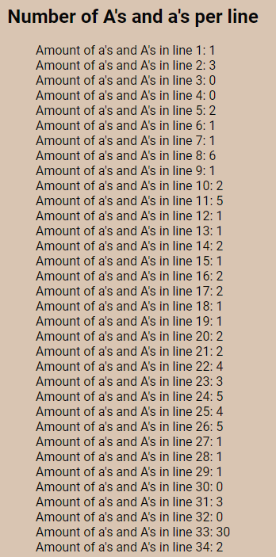

# Q1

## Base File Content

### Expected

Line 1: Hello world, this is a test document!
Line 2: Are there any apples?
Line 3: Sometimes, simplicity; often complexity.
Line 4: PHP: Hypertext Preprocessor.
Line 5: JavaScript vs. Python: Which is better?
Line 6: 1234567890, punctuation!
Line 7: The quick brown fox jumps over the lazy dog.
Line 8: An apple a day keeps the doctor away.
Line 9: To be or not to be, that is the question.
Line 10: Empty spaces: are interesting, right?
Line 11: Extra, extra, read all about it!
Line 12: abcdefghijklmnopqrstuvwxyz
Line 13: ABCDEFGHIJKLMNOPQRSTUVWXYZ
Line 14: Amazingly few discotheques provide jukeboxes.
Line 15: Pack my box with five dozen liquor jugs.
Line 16: Sphinx of black quartz, judge my vow.
Line 17: How vexingly quick daft zebras jump!
Line 18: Bright vixens jump; dozy fowl quack.
Line 19: Quick zephyrs blow, vexing daft Jim.
Line 20: Cozy lummox gives smart squid who asks for job pen.
Line 21: A wizard's job is to vex chumps quickly in fog.
Line 22: Watch "Jeopardy!", Alex Trebek's fun TV quiz game.
Line 23: A quick movement of the enemy will jeopardize six gunboats.
Line 24: All questions asked by five watched experts amaze the judge.
Line 25: Jack quietly moved up front and seized the big ball of wax.
Line 26: The job requires extra pluck and zeal from every young wage earner.
Line 27: The five boxing wizards jump quickly.
Line 28: cat
Line 29: dart
Line 30: Repetitive, repetitive, repetitive, repetitive, repetitive.
Line 31: End with punctuation! End with punctuation! End with punctuation!
Line 32: Test1234567890Test1234567890Test1234567890Test1234567890
Line 33: aaaaaAAAAAaaaaaAAAAAaaaaaAAAAA
Line 34: MixedCASElineWithMIXEDcaseLINE

### Actual Output

## Number of words per line

### Expected:

Amount of words in line 1: 7
Amount of words in line 2: 4
Amount of words in line 3: 4
Amount of words in line 4: 3
Amount of words in line 5: 6
Amount of words in line 6: 2
Amount of words in line 7: 9
Amount of words in line 8: 8
Amount of words in line 9: 10
Amount of words in line 10: 20
Amount of words in line 11: 6
Amount of words in line 12: 1
Amount of words in line 13: 1
Amount of words in line 14: 5
Amount of words in line 15: 8
Amount of words in line 16: 7
Amount of words in line 17: 6
Amount of words in line 18: 6
Amount of words in line 19: 6
Amount of words in line 20: 10
Amount of words in line 21: 10
Amount of words in line 22: 8
Amount of words in line 23: 10
Amount of words in line 24: 10
Amount of words in line 25: 12
Amount of words in line 26: 12
Amount of words in line 27: 6
Amount of words in line 28: 1
Amount of words in line 29: 1
Amount of words in line 30: 5
Amount of words in line 31: 9
Amount of words in line 32: 1
Amount of words in line 33: 1
Amount of words in line 34: 1

### Actual Output:

## Number of A's and a's per line

### Expected

Amount of a's and A's in line 1: 1
Amount of a's and A's in line 2: 3
Amount of a's and A's in line 3: 0
Amount of a's and A's in line 4: 0
Amount of a's and A's in line 5: 2
Amount of a's and A's in line 6: 1
Amount of a's and A's in line 7: 1
Amount of a's and A's in line 8: 6
Amount of a's and A's in line 9: 1
Amount of a's and A's in line 10: 2
Amount of a's and A's in line 11: 5
Amount of a's and A's in line 12: 1
Amount of a's and A's in line 13: 1
Amount of a's and A's in line 14: 2
Amount of a's and A's in line 15: 1
Amount of a's and A's in line 16: 2
Amount of a's and A's in line 17: 2
Amount of a's and A's in line 18: 1
Amount of a's and A's in line 19: 1
Amount of a's and A's in line 20: 2
Amount of a's and A's in line 21: 2
Amount of a's and A's in line 22: 4
Amount of a's and A's in line 23: 3
Amount of a's and A's in line 24: 5
Amount of a's and A's in line 25: 4
Amount of a's and A's in line 26: 5
Amount of a's and A's in line 27: 1
Amount of a's and A's in line 28: 1
Amount of a's and A's in line 29: 1
Amount of a's and A's in line 30: 0
Amount of a's and A's in line 31: 3
Amount of a's and A's in line 32: 0
Amount of a's and A's in line 33: 30
Amount of a's and A's in line 34: 2

### Actual Output

## Number of Common Punctuation Characters per line

### Expected

Amount of common punctuation in line 1: 8
Amount of common punctuation in line 2: 3
Amount of common punctuation in line 3: 5
Amount of common punctuation in line 4: 3
Amount of common punctuation in line 5: 6
Amount of common punctuation in line 6: 3
Amount of common punctuation in line 7: 9
Amount of common punctuation in line 8: 8
Amount of common punctuation in line 9: 11
Amount of common punctuation in line 10: 20
Amount of common punctuation in line 11: 8
Amount of common punctuation in line 12: 0
Amount of common punctuation in line 13: 0
Amount of common punctuation in line 14: 5
Amount of common punctuation in line 15: 8
Amount of common punctuation in line 16: 8
Amount of common punctuation in line 17: 6
Amount of common punctuation in line 18: 6
Amount of common punctuation in line 19: 7
Amount of common punctuation in line 20: 10
Amount of common punctuation in line 21: 11
Amount of common punctuation in line 22: 13
Amount of common punctuation in line 23: 10
Amount of common punctuation in line 24: 10
Amount of common punctuation in line 25: 12
Amount of common punctuation in line 26: 12
Amount of common punctuation in line 27: 6
Amount of common punctuation in line 28: 0
Amount of common punctuation in line 29: 0
Amount of common punctuation in line 30: 9
Amount of common punctuation in line 31: 11
Amount of common punctuation in line 32: 0
Amount of common punctuation in line 33: 0
Amount of common punctuation in line 34: 0

### Actual Output

## Middle Third Characters per Line

### Expected

Line 1: this is a te
Line 2: re any
Line 3: mplicity; ofte
Line 4: rtext Prep
Line 5: . Python: Whi
Line 6: 90, punc
Line 7: fox jumps over
Line 8: ay keeps the
Line 9: o be, that is
Line 10: are in
Line 11: a, read all
Line 12: jklmnopqr
Line 13: JKLMNOPQR
Line 14: iscotheques pro
Line 15: ith five dozen
Line 16: ack quartz, j
Line 17: quick daft
Line 18: s jump; dozy
Line 19: s blow, vexi
Line 20: smart squid who
Line 21: s to vex chumps
Line 22: , Alex Trebek's f
Line 23: the enemy will jeopa
Line 24: by five watched expe
Line 25: p front and seized t
Line 26: pluck and zeal from ev
Line 27: ing wizards j
Line 28: a
Line 29: ar
Line 30: ve, repetitive, repe
Line 31: End with punctuation!
Line 32: 234567890Test123456
Line 33: aaaaaAAAAA
Line 34: ineWithMIX

### Actual Output

## Searching Section

### Expected - With Search Term = "quick"

"" Representing where it should be highlighted

Line 6: The "quick" brown fox jumps over the lazy dog.
Line 16: How vexingly "quick" daft zebras jump!
Line 20: A wizard's job is to vex chumps "quick"ly in fog.
Line 22: A "quick" movement of the enemy will jeopardize six gunboats.
Line 26: The five boxing wizards jump "quick"ly.
Number of Strings omitted due to them missing search term: 29

### Actual Output

